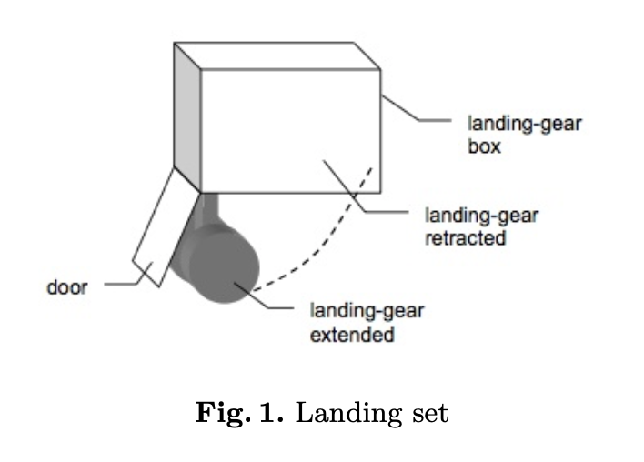

# ANSYS CADE Project

* Softerware : ANSYS SCADE

Here are some project completed by the softerware anses cade. 

## Landing_gear_system

* Author : Yan CHEN & kai ZHANG

This system is made up of two parts. The first one is gear outgoing. The second one is gear retraction.

This project includes the simulation in both normal and abnormal modes.

## Dataflow

* Author : Yan CHEN

1. implement a detector of rising and falling edges in a Boolean signal.

2. implement the third order linear moving average filter.

3. define an operator that counts.

## Voter

* Author : Yan CHEN

The general specification of the vector to be implemented is as follows:

* if at time t the three inputs are equal then the output of the vector is the common value

* if at time t one input differs from the other two for the first time (i.e. the three inputs are considered valid until time t), then this input is considered invalid and is definitely eliminated. Only the other two entries will be considered for future times. At time t, the value returned by the voter is the common value of the two inputs.

* if one input has already been eliminated, and if at time t the last two inputs are different, then the sensor is considered invalid and the vector sets an error output to true.

## Pressure sensor

* Author : Yan CHEN

We consider a model consisting of two operators. The first one allows to detect when a pressure value is greater than a threshold. The second one activates an alarm signal for a fixed duration when the pressure is detected as too high.